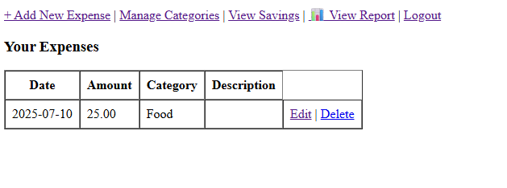
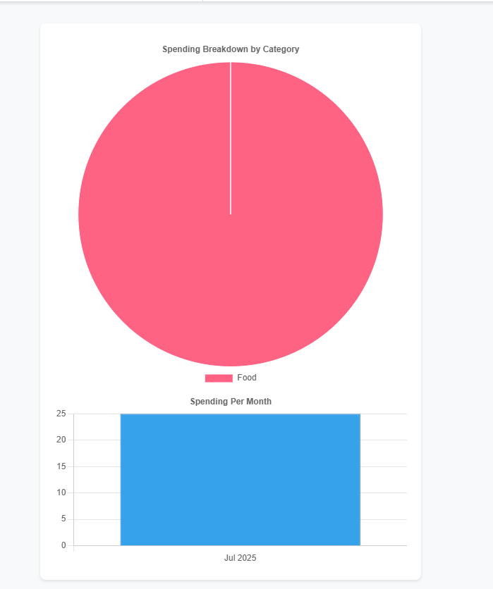
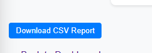

# 💰 Expense Tracker

A personal expense tracker with a visual dashboard, built using **PHP** and **SQLite**. Track daily expenses, categorize spending, and monitor savings — all in one simple web app.

---

## 🚀 Features

- ✅ User authentication (login, logout)
- ✅ Add and manage expenses by category
- ✅ Add and track savings goals
- ✅ Visual dashboard (category breakdown, monthly charts)
- ✅ Filter by date range
- ✅ Export reports as CSV
- ✅ Built with PHP + SQLite + Chart.js
- ✅ Bootstrap layout for clean UI

---

## 📂 Folder Structure

```bash
/expense-tracker
│
├── index.php
├── login.php / register.php
├── addExpense.php / viewExpenses.php / editExpense.php
├── addSaving.php / view_savings.php / editSaving.php
├── report.php           # Summary & charts
├── export_csv.php       # CSV export
├── includes/
│   └── db.php           # PDO connection

---

## 🧑‍💻 Tech Stack

- **Backend**: PHP (vanilla)
- **Database**: SQLite (PDO)
- **Frontend**: HTML, CSS
- **Charts**: Chart.js

---

## 📦 Setup Instructions

1. Clone or download this repository.
2. Run it using **XAMPP**, **Laragon**, or any local PHP server.
3. Make sure `db.php` is pointing to the right SQLite file.
4. Register a user, then login.
5. Start adding expenses and savings!

---

## 📸 Screenshots

_Add screenshots of:_
- Dashboard

- Add Expense

- Report page with charts


- CSV export button


---

## 📌 Notes

- This project is for personal budgeting and learning purposes.
- No external frameworks (like Laravel) used — everything is built from scratch using core PHP.
- Secure database operations using PDO (prepared statements).
- You can easily extend it with income tracking, recurring bills, or cloud deployment.

---

## 📄 License

MIT License — free to use and modify.

---

## 🤝 Contributing

Pull requests are welcome! For major changes, please open an issue first to discuss what you’d like to change.

Feel free to fork and customize for your own use!

---

## 🙏 Credits

- [Chart.js](https://www.chartjs.org/)
- PHP Docs & StackOverflow (for fixing SQLite quirks 😅)

